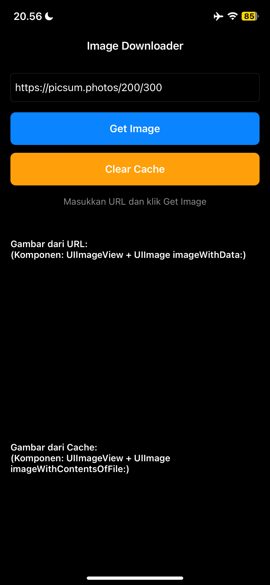
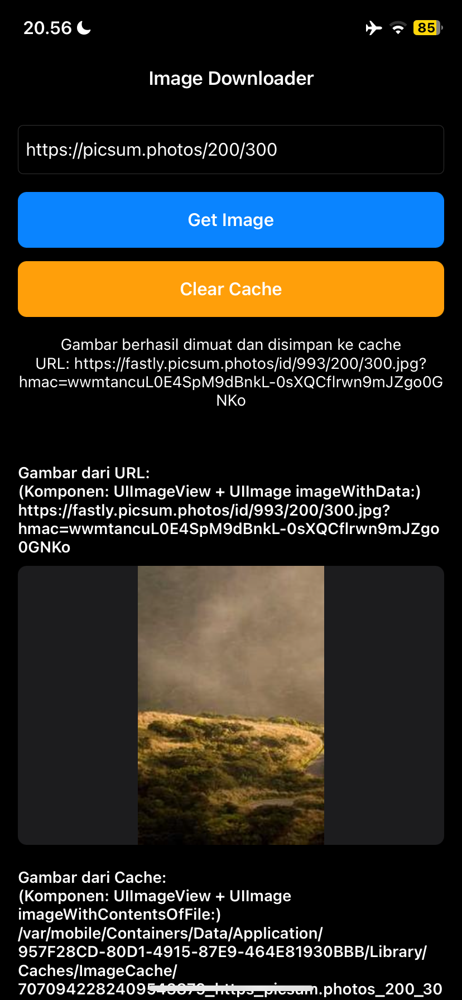

# File - iOS Image Downloader

A native iOS application that demonstrates image downloading, caching, and display using multiple methods. Built with Objective-C and UIKit, deployed using the Nyxian toolchain.

## Overview

This app allows users to download images from URLs and displays them using three different approaches:

- **UIImageView with UIImage from URL data** - Direct image loading from network
- **UIImageView with UIImage from cached file** - Loading from local file system cache
- **WKWebView with HTML5 img tag** - Displaying cached images using file:// protocol

## Requirements

- iOS 17.0 or later
- Apple Developer Account (free or paid)
- Nyxian IDE installed on your iOS device
- Certificate for signing the app

## Features

- Download images from URLs
- Automatic image caching to local storage
- Display images using UIImageView (URL and cache)
- Display images using WKWebView with HTML5
- Clear cache functionality
- Keyboard handling with scroll view adjustments
- Loading indicators and status messages

## Project Structure

```
.
├── AppDelegate.h              # Application delegate header
├── AppDelegate.m              # Application delegate implementation
├── Main.m                     # Application entry point
├── ViewController.h           # Main view controller header
├── ViewController.m           # Main view controller implementation
├── Config/
│   ├── Project.plist          # Project configuration (bundle ID, version, frameworks, linker flags)
│   └── Editor.plist           # Editor settings
├── Managers/
│   ├── ImageCacheManager.h    # Image cache manager header
│   └── ImageCacheManager.m    # Image cache manager implementation
├── Resources/                 # App resources (currently empty)
└── Screenshots/               # App screenshots
```

## Frameworks

- **Foundation** - Basic Objective-C classes and utilities
- **UIKit** - User interface components
- **WebKit** - WKWebView for HTML5 image display
- **QuartzCore** - Core Animation and layer styling

## Deployment

This project uses [Nyxian](https://github.com/ProjectNyxian/Nyxian) for deployment. Nyxian is an iOS IDE that allows you to develop, compile, and run native iOS apps directly on unjailbroken iOS devices.

### Setup Instructions

1. Sign Nyxian using your Apple Developer certificate
2. Install Nyxian on your iOS device
3. Import the same certificate used for signing Nyxian
4. Open this project in Nyxian
5. Build and run the app

## Screenshots




## Usage

1. Enter an image URL in the text field (default: `https://picsum.photos/200/300`)
2. Tap "Get Image" to download and display the image
3. The app will show the image in three different ways:
   - From URL (UIImageView with network data)
   - From Cache (UIImageView with cached file)
   - HTML5 (WKWebView with file:// protocol)
4. Tap "Clear Cache" to remove all cached images

## Technical Details

- **Language**: Objective-C
- **Memory Management**: ARC (Automatic Reference Counting)
- **Architecture**: MVC (Model-View-Controller)
- **Cache Location**: `NSCachesDirectory/ImageCache`
- **Bundle Identifier**: `com.example.file`
- **Minimum iOS Version**: 17.0

## Notes

- Images are cached using URL hash as the filename
- Cache persists between app launches
- WKWebView is configured for inline media playback
- The app handles keyboard appearance and adjusts scroll view accordingly
